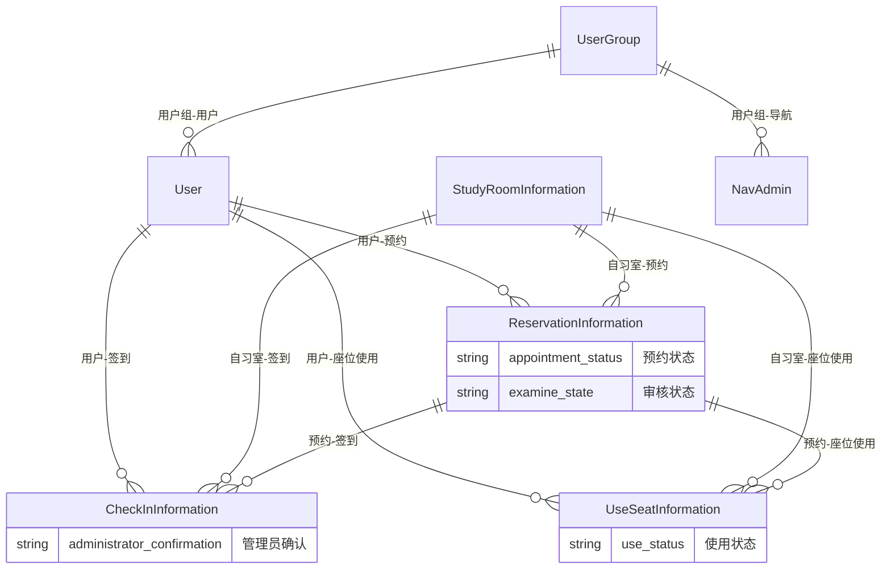

# 自习预约管理系统 (Study Room Reservation Management System)

## 📋 项目概述

自习室预约管理系统是一个基于Spring Boot + Vue.js的现代化自习室预约与管理平台，支持多商家自习室运营、用户预约管理、座位状态实时监控、签到确认等核心功能。系统采用前后端分离架构，具备良好的可扩展性和维护性。

### 🎯 核心特性

- **多商家支持**：支持多个商家入驻的复杂业务场景
- **实时座位管理**：动态座位状态更新和可用性监控
- **预约生命周期**：完整的预约→签到→使用→完成流程
- **权限管理**：基于RBAC的用户权限控制系统
- **响应式设计**：支持PC端和移动端访问
- **审核机制**：管理员审核和确认机制确保系统安全

## 🏗️ 技术架构

### 整体架构图

```
┌─────────────────┐              ┌─────────────────┐
│   用户端界面     │              │   管理端界面     │
│   (Vue.js)      │              │   (Vue.js)      │
│                 │              │                 │
│ - 用户预约功能  │              │ - 后台管理功能  │
│ - 自习室浏览    │              │ - 数据统计分析  │
│ - 个人信息管理  │              │ - 用户权限管理  │
└─────────────────┘              └─────────────────┘
         │                               │
         └───────────────┬───────────────┘
                         │
            ┌─────────────────┐
            │ Spring Boot     │
            │ Backend         │
            │ API Server      │
            └─────────────────┘
            ┌─────────────────┐
            │   MySQL DB      │
            └─────────────────┘
```

### 后端架构设计

#### 项目目录结构
```
server/
├── src/main/java/com/project/demo/
│   ├── Application.java                 # Spring Boot启动类
│   ├── config/                          # 配置层
│   │   └── WebAppConfig.java            # Web应用配置
│   ├── controller/                      # 控制器层 (MVC)
│   │   ├── base/
│   │   │   └── BaseController.java      # 通用控制器基类
│   │   ├── ReservationInformationController.java
│   │   ├── StudyRoomInformationController.java
│   │   ├── CheckInInformationController.java
│   │   ├── UserController.java
│   │   └── ...                          # 其他业务控制器
│   ├── service/                         # 服务层 (业务逻辑)
│   │   ├── base/
│   │   │   └── BaseService.java         # 通用服务基类
│   │   ├── ReservationInformationService.java
│   │   ├── StudyRoomInformationService.java
│   │   ├── UserService.java
│   │   └── ...                          # 其他业务服务
│   ├── dao/                             # 数据访问层
│   │   ├── base/
│   │   │   └── BaseMapper.java          # 通用Mapper基类
│   │   ├── ReservationInformationMapper.java
│   │   ├── UserMapper.java
│   │   └── ...                          # 其他数据访问接口
│   ├── entity/                          # 实体类 (数据模型)
│   │   ├── base/
│   │   │   └── BaseEntity.java          # 通用实体基类
│   │   ├── ReservationInformation.java
│   │   ├── StudyRoomInformation.java
│   │   ├── User.java
│   │   ├── UserGroup.java
│   │   ├── CheckInInformation.java
│   │   └── ...                          # 其他实体类
│   └── interceptor/                     # 拦截器层
│       └── LoginInterceptor.java        # 登录拦截器
└── src/main/resources/
    ├── mapper/                          # MyBatis XML映射文件
    │   ├── ReservationInformationMapper.xml
    │   ├── UserMapper.xml
    │   └── ...                          # 其他Mapper XML
    └── application.yml                  # 应用配置文件
```

#### 后端技术栈
- **框架**：Spring Boot 2.x
- **Web框架**：Spring MVC
- **数据访问**：MyBatis + MyBatis-Plus
- **数据库**：MySQL 5.7+
- **安全**：Spring Security + JWT
- **文档**：Swagger API文档
- **日志**：SLF4J + Logback
- **工具**：Lombok、Validation、Hibernate Validator
- **构建工具**：Maven 3.6+
- **应用服务器**：内嵌Tomcat
- **API通信**：RESTful API + JSON数据格式

#### 分层架构详解

**1. 控制器层 (Controller Layer)**
- 负责接收HTTP请求
- 参数验证和转换
- 调用服务层处理业务逻辑
- 返回JSON响应
- 实现RESTful API设计

**2. 服务层 (Service Layer)**
- 封装业务逻辑
- 事务管理
- 数据验证
- 调用数据访问层
- 实现复杂的业务流程

**3. 数据访问层 (DAO Layer)**
- 数据库CRUD操作
- SQL语句管理
- MyBatis映射配置
- 分页查询支持
- 动态SQL处理

**4. 实体层 (Entity Layer)**
- 数据模型定义
- JPA注解配置
- 数据验证规则
- 序列化支持

### 前端架构设计

项目包含两个独立的Vue.js前端应用：

#### 1. 用户端前端 (client_home)

**项目目录结构**
```
client_home/
├── src/
│   ├── main.js                          # Vue应用入口
│   ├── App.vue                          # 根组件
│   ├── assets/                          # 静态资源
│   │   ├── images/                      # 图片资源
│   │   ├── style/                       # 样式文件
│   │   └── js/                          # JavaScript库
│   ├── components/                      # 公共组件
│   │   ├── common/                      # 基础组件
│   │   │   ├── page_header.vue          # 页面头部
│   │   │   ├── page_footer.vue          # 页面底部
│   │   │   └── slidePicture.vue         # 轮播图
│   │   └── diy/                         # 业务组件
│   │       ├── div_reservation_information.vue  # 预约组件
│   │       ├── div_study_room_information.vue   # 自习室组件
│   │       └── ...                      # 其他业务组件
│   ├── views/                           # 页面组件
│   │   ├── account/                     # 账户管理
│   │   │   ├── login.vue                # 登录页面
│   │   │   ├── register.vue             # 注册页面
│   │   │   └── forgot.vue               # 忘记密码
│   │   ├── reservation_information/      # 预约管理
│   │   │   ├── history.vue              # 预约历史
│   │   │   └── edit.vue                 # 预约编辑
│   │   ├── study_room_information/       # 自习室管理
│   │   │   ├── list.vue                 # 自习室列表
│   │   │   └── details.vue              # 自习室详情
│   │   ├── user/                        # 用户中心
│   │   │   ├── index.vue                # 用户首页
│   │   │   ├── info.vue                 # 个人信息
│   │   │   └── collect.vue              # 我的收藏
│   │   └── ...                          # 其他页面
│   ├── router/                          # 路由配置
│   │   └── index.js                     # 路由定义
│   ├── store/                           # 状态管理
│   │   ├── index.js                     # 根Store
│   │   ├── user.js                      # 用户状态
│   │   └── web.js                       # 网站配置
│   ├── services/                        # 外部服务
│   │   ├── historyService.js            # 历史记录服务
│   │   ├── poetryService.js             # 诗词服务
│   │   ├── weatherService.js            # 天气服务
│   │   └── zhihuNews.js                 # 知乎新闻服务
│   ├── plugins/                         # 插件配置
│   │   ├── index.js                     # 插件注册
│   │   ├── component.js                 # 组件插件
│   │   ├── sdk.js                       # SDK配置
│   │   └── expand.js                    # 功能扩展
│   └── mixins/                          # 混入对象
│       ├── component.js                 # 组件混入
│       └── page.js                      # 页面混入
├── public/                              # 公共资源
│   ├── css/                             # 公共样式
│   ├── img/                             # 公共图片
│   └── index.html                       # HTML入口
└── package.json                         # 依赖配置
```

#### 2. 管理端前端 (client_admin)

**项目目录结构**
```
client_admin/
├── src/
│   ├── main.js                          # Vue应用入口
│   ├── App.vue                          # 根组件
│   ├── assets/                          # 静态资源
│   │   ├── images/                      # 图片资源
│   │   ├── style/                       # 样式文件
│   │   └── js/                          # JavaScript库
│   ├── components/                      # 通用组件
│   │   ├── common/                      # 基础组件
│   │   │   ├── page_header.vue          # 页面头部
│   │   │   ├── page_side.vue            # 侧边栏
│   │   │   ├── page_footer.vue          # 页面底部
│   │   │   └── slidePicture.vue         # 轮播图
│   │   ├── charts/                      # 图表组件
│   │   │   ├── bar_chart.vue            # 柱状图
│   │   │   ├── line_chart.vue           # 折线图
│   │   │   └── pie_chart.vue            # 饼图
│   │   └── dashboard_stats.vue          # 仪表盘统计
│   ├── views/                           # 页面组件
│   │   ├── login.vue                    # 登录页面
│   │   ├── index.vue                    # 首页
│   │   ├── user/                        # 用户管理
│   │   │   ├── table.vue                # 用户列表
│   │   │   ├── view.vue                 # 用户详情
│   │   │   ├── info.vue                 # 个人信息
│   │   │   └── password.vue             # 密码管理
│   │   ├── reservation_information/      # 预约管理
│   │   │   ├── table.vue                # 预约列表
│   │   │   └── view.vue                 # 预约详情
│   │   ├── study_room_information/       # 自习室管理
│   │   │   ├── table.vue                # 自习室列表
│   │   │   └── view.vue                 # 自习室详情
│   │   ├── check_in_information/         # 签到管理
│   │   │   ├── table.vue                # 签到列表
│   │   │   └── view.vue                 # 签到详情
│   │   ├── use_seat_information/         # 座位使用管理
│   │   ├── ordinary_users/              # 普通用户管理
│   │   ├── study_room_administrator/    # 自习室管理员
│   │   └── ...                          # 其他业务页面
│   ├── router/                          # 路由配置
│   │   └── index.js                     # 路由定义
│   ├── store/                           # 状态管理
│   │   ├── index.js                     # 根Store
│   │   ├── user.js                      # 用户状态
│   │   └── web.js                       # 网站配置
│   ├── plugins/                         # 插件配置
│   │   ├── index.js                     # 插件注册
│   │   ├── component.js                 # 组件插件
│   │   └── sdk.js                       # SDK配置
│   ├── mixins/                          # 混入对象
│   │   ├── component.js                 # 组件混入
│   │   ├── item.js                      # 项混入
│   │   └── page.js                      # 页面混入
│   └── html/                            # HTML模板
│       ├── admin/                       # 管理端模板
│       ├── user/                        # 用户端模板
│       └── common/                      # 通用模板
├── public/                              # 公共资源
│   ├── css/                             # 公共样式
│   ├── img/                             # 公共图片
│   └── index.html                       # HTML入口
└── package.json                         # 依赖配置
```

#### 前端技术栈
- **框架**：Vue.js 2.6+ + Vue Router 3.x
- **状态管理**：Vuex 3.x
- **UI组件库**：Element UI 2.15+
- **HTTP客户端**：Axios
- **构建工具**：Webpack 4.x + Babel 7.x
- **CSS预处理器**：SCSS
- **包管理器**：NPM 6.x+
- **开发服务器**：Webpack Dev Server

#### 未使用代码及可扩展方向

在项目中存在一些暂时未使用的代码，这些代码通常是为了未来的功能扩展或特定需求而预先准备的。以下是client_admin目录中未使用的代码及其可扩展方向：

##### 1. HTML模板文件

client_admin/src/html/目录中包含了多个HTML模板文件，这些文件使用了EJS风格的模板语法，目前未被使用。

- **主要文件**：
  - index.html
  - article/list.html
  - common/header.html

- **可扩展方向**：
  1. 可用于生成静态网站或营销页面
  2. 可作为邮件模板使用
  3. 可集成到静态站点生成器中
  4. 可用于生成系统说明文档或帮助页面

##### 2. 音频和视频组件

client_admin/src/components/diy/目录下的音频和视频播放组件目前未被使用。

- **主要组件**：
  - div_audio.vue
  - div_video.vue

- **可扩展方向**：
  1. 可集成到自习室介绍页面中，播放自习室介绍视频
  2. 可作为学习资源模块的一部分，播放学习教程视频
  3. 可用于播放公告通知的音频版本
  4. 可扩展为支持多种音频/视频格式和播放列表功能

##### 3. 图表组件

client_admin/src/components/charts/目录下的新版图表组件目前未被使用。

- **主要组件**：
  - new_bar_chart.vue
  - new_line_chart.vue

- **可扩展方向**：
  1. 可用于展示自习室使用率对比数据
  2. 可用于展示不同时间段内的预约数量统计
  3. 可集成到管理员仪表板中，展示各类统计数据
  4. 可扩展为支持更多图表类型和交互功能

##### 4. div_label组件

client_admin/src/components/div_label.vue组件虽然存在，但在项目中未被使用。

- **可扩展方向**：
  1. 可用于创建快速导航卡片
  2. 可用于展示关键业务指标
  3. 可集成到用户仪表板中，显示个人信息摘要
  4. 可扩展为支持更多样式和交互功能

#### 前端架构模式

**1. MVC架构模式**
- **Model**：Vuex Store中的状态和数据
- **View**：Vue组件和模板
- **Controller**：组件中的methods和computed

**2. 组件化开发**
- **页面组件**：views/目录下的完整页面
- **业务组件**：components/目录下的可复用组件
- **基础组件**：通用UI组件和工具组件

**3. 状态管理**
- **全局状态**：用户信息、权限、系统配置
- **页面状态**：组件内部状态管理
- **缓存策略**：本地存储和内存缓存

**4. 路由管理**
- **静态路由**：基础页面路由
- **动态路由**：基于权限的动态路由生成
- **路由守卫**：登录验证和权限控制

#### 前后端交互

**1. API通信协议**
```javascript
// 前端API调用配置 (client_admin/src/plugins/sdk.js)
const api = {
  baseUrl: 'http://localhost:8080/api',  // Spring Boot后端API地址
  timeout: 10000,
  headers: {
    'Content-Type': 'application/json',
    'Authorization': 'Bearer ' + $.db.get("token")  // JWT Token认证
  }
}

// 统一的请求处理封装
export const request = (config) => {
  return new Promise((resolve, reject) => {
    axios({
      url: api.baseUrl + config.url,
      method: config.method || 'GET',
      data: config.data,
      headers: api.headers
    }).then(response => {
      resolve(response.data);
    }).catch(error => {
      reject(error);
    });
  });
}
```

**2. 数据流转**
```
前端请求 → API网关 → Spring Boot控制器 → 服务层 → 数据访问层 → MySQL
     ↑                                                                      ↓
前端组件 ← JSON响应 ← 控制器返回 ← 服务处理 ← Mapper查询 ← 数据库结果
```

**3. 错误处理**
- **前端**：全局错误拦截器，统一错误提示
- **后端**：统一异常处理，标准错误响应格式
- **网络**：请求超时和重试机制

## 📊 系统功能模块

### 1. 用户管理模块 (User Management)

#### 功能描述
用户管理模块是系统的核心基础，负责用户的全生命周期管理和权限控制。

#### 核心功能
- **用户注册登录**
  - 手机号/邮箱注册
  - 密码登录和找回
  - JWT Token认证机制
  - 登录状态保持

- **用户信息管理**
  - 个人信息维护
  - 头像上传和更换
  - 实名认证
  - 联系方式验证

- **权限控制系统**
  - 基于RBAC的角色权限模型
  - 用户组管理（user_group表）
  - 动态权限分配
  - API访问控制

#### 技术实现
```java
// 用户实体 (entity/User.java)
@Entity
public class User implements Serializable {
    private Integer userId;           // 用户ID
    private String username;          // 用户名
    private String nickname;          // 昵称
    private String password;          // 密码（加密存储）
    private String email;             // 邮箱
    private String phone;             // 手机号
    private Integer userGroup;        // 用户组ID
    private Integer state;            // 账户状态
    private String avatar;            // 头像地址
    private Timestamp createTime;     // 创建时间
}

// 用户组实体 (entity/UserGroup.java)
@Entity
public class UserGroup implements Serializable {
    private Integer groupId;          // 用户组ID
    private String name;              // 组名
    private String sourceTable;       // 源数据表
    private String sourceField;       // 源数据字段
    private Integer display;          // 显示顺序
    private String register;          // 注册位置
}
```

#### 前端实现
- **登录页面** (`views/login.vue`)
- **用户管理** (`views/user/`)
  - 用户列表 (`table.vue`)
  - 用户详情 (`view.vue`)
  - 用户编辑

### 2. 自习室管理模块 (Study Room Management)

#### 功能描述
管理所有自习室的基础信息、设施配置、价格策略等核心业务数据。

#### 核心功能
- **自习室信息管理**
  - 自习室基本信息录入
  - 地理位置和区域管理
  - 营业时间设置
  - 管理员联系方式

- **设施配置管理**
  - 座位数量和类型配置
  - 座位类型定义（普通座、VIP座、包间等）
  - 设施设备管理
  - 环境图片展示

- **价格策略管理**
  - 按小时计费配置
  - 不同座位类型价格
  - 优惠活动设置
  - 实时价格计算

- **审核机制**
  - 自习室信息审核流程
  - 管理员审核确认
  - 审核状态跟踪

#### 技术实现
```java
// 自习室信息实体 (entity/StudyRoomInformation.java)
@Entity
public class StudyRoomInformation implements Serializable {
    private Integer studyRoomInformationId;  // 主键ID
    private Integer business;                // 商家ID
    private String nameOfStudyRoom;          // 自习室名称
    private String studyRoomType;            // 自习室类型
    private String region;                   // 区域
    private String openingHours;             // 开放时间
    private String administratorTelephone;   // 管理员电话
    private String address;                  // 地址
    private String numberOfSeats;            // 座位数量
    private String seatType;                 // 座位类型
    private Integer spareSeats;              // 空余座位
    private String hourlyRate;               // 每小时价格
    private String selfStudyRoomPictures;    // 自习室图片
    private String introductionToSelfStudyRoom; // 自习室简介
    private String examineState;             // 审核状态
    private String examineReply;             // 审核回复
}
```

#### 前端实现
- **自习室管理** (`views/study_room_information/`)
  - 自习室列表 (`table.vue`)
  - 自习室详情 (`view.vue`)
  - 地图位置展示
  - 图片轮播展示

### 3. 预约管理模块 (Reservation Management)

#### 功能描述
处理用户预约自习室座位的完整流程，包括预约创建、状态跟踪、费用计算等。

#### 核心功能
- **在线预约功能**
  - 自习室选择
  - 时间段选择
  - 人数设定
  - 座位偏好选择

- **预约状态管理**
  - 预约创建（待确认）
  - 管理员确认
  - 用户签到（已确认）
  - 使用完成
  - 取消预约

- **费用计算系统**
  - 自动费用计算（时间 × 人数 × 单价）
  - 优惠折扣计算
  - 费用明细展示
  - 支付状态跟踪

- **预约管理**
  - 预约修改
  - 预约取消
  - 重复预约检查
  - 预约历史查询

#### 技术实现
```java
// 预约信息实体 (entity/ReservationInformation.java)
@Entity
public class ReservationInformation implements Serializable {
    private Integer reservationInformationId;  // 主键ID
    private Integer user;                      // 用户ID
    private String fullName;                   // 姓名
    private String contactInformation;         // 联系方式
    private String nameOfStudyRoom;            // 自习室名称
    private String studyRoomType;              // 自习室类型
    private String appointmentPeriod;          // 预约时段
    private Integer numberOfAppointments;      // 预约人数
    private String totalCost;                  // 总费用
    private String appointmentStatus;          // 预约状态
    private String examineState;               // 审核状态
    private String examineReply;               // 审核回复
    private String payingMethod;               // 支付方式
    private Timestamp appointmentTime;         // 预约时间
    private Timestamp updateTime;              // 更新时间
    private Timestamp createTime;              // 创建时间
}
```

#### 前端实现
- **预约管理** (`views/reservation_information/`)
  - 预约列表 (`table.vue`)
  - 预约详情 (`view.vue`)
  - 预约表单动态生成
  - 权限控制表单字段

### 4. 签到管理模块 (Check-in Management)

#### 功能描述
管理用户到店签到的流程，包括签到验证、管理员确认、异常处理等。

#### 核心功能
- **签到验证系统**
  - 用户身份验证
  - 预约信息核对
  - 时间段验证
  - 地点确认

- **管理员确认机制**
  - 人工审核确认
  - 异常签到处理
  - 签到状态更新
  - 确认记录追踪

- **签到状态管理**
  - 正常签到
  - 迟到处理
  - 提前到达
  - 未到记录

- **异常处理**
  - 代签检测
  - 时间异常处理
  - 位置异常处理
  - 重复签到防护

#### 技术实现
```java
// 签到信息实体 (entity/CheckInInformation.java)
@Entity
public class CheckInInformation implements Serializable {
    private Integer checkInInformationId;      // 主键ID
    private Integer user;                      // 用户ID
    private String fullName;                   // 姓名
    private String contactInformation;         // 联系方式
    private String nameOfStudyRoom;            // 自习室名称
    private String appointmentPeriod;          // 预约时段
    private Integer numberOfAppointments;      // 预约人数
    private String administratorConfirmation;  // 管理员确认
    private Timestamp updateTime;              // 更新时间
    private Timestamp createTime;              // 创建时间
}
```

#### 前端实现
- **签到管理** (`views/check_in_information/`)
  - 签到列表 (`table.vue`)
  - 签到详情 (`view.vue`)
  - 签到状态展示
  - 管理员确认界面

### 5. 座位使用模块 (Seat Usage)

#### 功能描述
实时管理自习室座位的使用状态，提供座位监控和使用统计功能。

#### 核心功能
- **实时座位监控**
  - 座位状态实时更新
  - 可用座位数量统计
  - 座位使用时长记录
  - 座位分配管理

- **使用状态管理**
  - 空闲状态
  - 使用中状态
  - 预定状态
  - 维护状态

- **超时管理**
  - 使用时长监控
  - 超时提醒机制
  - 自动释放座位
  - 违约记录

- **统计分析**
  - 座位使用率统计
  - 高峰时段分析
  - 用户使用习惯分析
  - 收入统计分析

#### 技术实现
```java
// 座位使用信息实体 (entity/UseSeatInformation.java)
@Entity
public class UseSeatInformation implements Serializable {
    private Integer useSeatInformationId;      // 主键ID
    private Integer user;                      // 用户ID
    private String nameOfStudyRoom;            // 自习室名称
    private String seatNumber;                 // 座位号
    private String useStatus;                  // 使用状态
    private String useStartTime;               // 开始使用时间
    private String useEndTime;                 // 结束使用时间
    private String actualUseDuration;          // 实际使用时长
    private String costAmount;                 // 费用金额
    private Timestamp updateTime;              // 更新时间
    private Timestamp createTime;              // 创建时间
}
```

#### 前端实现
- **座位使用管理** (`views/use_seat_information/`)
  - 座位状态展示
  - 使用时长统计
  - 费用计算展示
  - 实时状态更新

### 6. 通知公告模块 (Notice System)

#### 功能描述
管理系统公告、预约提醒、状态变更通知等信息发布和推送功能。

#### 核心功能
- **公告管理**
  - 公告发布和编辑
  - 公告分类管理
  - 公告置顶功能
  - 公告时效性控制

- **消息通知**
  - 预约确认通知
  - 签到提醒通知
  - 费用支付通知
  - 异常状态通知

- **通知推送**
  - 站内消息推送
  - 邮件通知（可选）
  - 短信通知（可选）
  - 推送时机控制

- **通知管理**
  - 通知历史记录
  - 已读/未读状态
  - 通知删除管理
  - 批量操作支持

#### 技术实现
```java
// 公告通知实体 (entity/Notice.java)
@Entity
public class Notice implements Serializable {
    private Integer noticeId;                  // 公告ID
    private String noticeTitle;                // 公告标题
    private String noticeContent;              // 公告内容
    private String noticeType;                 // 公告类型
    private Integer display;                   // 显示顺序
    private String state;                      // 状态
    private Timestamp updateTime;              // 更新时间
    private Timestamp createTime;              // 创建时间
}
```

#### 前端实现
- **公告管理** (`views/notice/`)
  - 公告列表 (`table.vue`)
  - 公告详情 (`view.vue`)
  - 公告发布表单
  - 消息中心

### 7. 数据统计模块 (Dashboard)

#### 功能描述
提供系统运行数据的多维度统计分析，支持决策制定和业务优化。

#### 核心功能
- **运营数据统计**
  - 预约量统计
  - 用户增长统计
  - 收入统计
  - 座位使用率统计

- **图表展示**
  - 柱状图统计
  - 折线图趋势
  - 饼图占比
  - 仪表盘展示

- **数据导出**
  - Excel报表导出
  - 自定义时间段统计
  - 数据对比分析
  - 历史数据查询

#### 前端实现
- **统计仪表盘** (`components/dashboard_stats.vue`)
- **图表组件** (`components/charts/`)
  - 柱状图 (`bar_chart.vue`)
  - 折线图 (`line_chart.vue`)
  - 饼图 (`pie_chart.vue`)

### 8. 系统配置模块 (System Config)

#### 功能描述
管理系统的基础配置、轮播图、导航菜单等系统级功能。

#### 核心功能
- **轮播图管理**
  - 首页轮播图配置
  - 图片上传和管理
  - 链接地址设置
  - 显示顺序控制

- **导航管理**
  - 网站导航菜单
  - 管理员导航菜单
  - 权限控制导航
  - 动态菜单生成

- **文章管理**
  - 帮助文档
  - 使用说明
  - 常见问题
  - 系统公告

#### 技术实现
```java
// 轮播图表 (entity/Slides.java)
@Entity
public class Slides implements Serializable {
    private Integer slidesId;                  // 轮播图ID
    private String name;                       // 名称
    private String url;                        // 链接地址
    private String picture;                    // 图片地址
    private Integer display;                   // 显示顺序
    private String state;                      // 状态
}

// 导航表 (entity/NavAdmin.java)
@Entity
public class NavAdmin implements Serializable {
    private Integer navAdminId;                // 导航ID
    private String name;                       // 导航名称
    private String url;                        // 链接地址
    private Integer display;                   // 显示顺序
    private String type;                       // 导航类型
}
```

#### 前端实现
- **轮播图管理** (`views/slides/`)
- **导航管理** (`views/nav/`)
- **文章管理** (`views/article/`)
- **文章分类** (`views/article_type/`)

## 🗄️ 数据库设计

### 数据库架构概览

#### 核心设计原则
1. **规范化设计**：遵循第三范式，减少数据冗余
2. **索引优化**：为常用查询字段建立索引
3. **外键约束**：保证数据完整性和一致性
4. **时间戳记录**：所有表都包含创建和更新时间
5. **状态管理**：重要业务表包含状态字段
6. **审计追踪**：记录重要操作的完整历史

### 核心实体关系



### 详细数据表设计

#### 1. 用户相关表 (User Management)

##### user - 用户基本信息表
```sql
CREATE TABLE `user` (
  `user_id` int(11) NOT NULL AUTO_INCREMENT COMMENT '用户ID',
  `username` varchar(64) NOT NULL DEFAULT '' COMMENT '用户名',
  `nickname` varchar(64) NOT NULL DEFAULT '' COMMENT '昵称',
  `password` varchar(100) NOT NULL DEFAULT '' COMMENT '密码(加密)',
  `email` varchar(64) NOT NULL DEFAULT '' COMMENT '邮箱',
  `phone` varchar(16) NOT NULL DEFAULT '' COMMENT '手机号',
  `avatar` varchar(255) NOT NULL DEFAULT '' COMMENT '头像地址',
  `user_group` int(11) NOT NULL DEFAULT '0' COMMENT '用户组ID',
  `state` int(11) NOT NULL DEFAULT '1' COMMENT '账户状态(1可用|2异常|3已冻结|4已注销)',
  `update_time` timestamp NOT NULL DEFAULT CURRENT_TIMESTAMP ON UPDATE CURRENT_TIMESTAMP COMMENT '更新时间',
  `create_time` timestamp NOT NULL DEFAULT CURRENT_TIMESTAMP COMMENT '创建时间',
  PRIMARY KEY (`user_id`),
  UNIQUE KEY `username` (`username`),
  KEY `idx_user_group` (`user_group`),
  KEY `idx_state` (`state`)
) ENGINE=InnoDB DEFAULT CHARSET=utf8mb4 COMMENT='用户基本信息表';
```

**字段说明：**
- `user_id`：主键，自增ID，支持8388607个用户
- `username`：登录用户名，唯一索引
- `password`：加密存储的密码，建议使用BCrypt
- `user_group`：外键，关联user_group表
- `state`：账户状态，支持用户生命周期管理

##### user_group - 用户组表
```sql
CREATE TABLE `user_group` (
  `group_id` int(11) NOT NULL AUTO_INCREMENT COMMENT '用户组ID',
  `name` varchar(16) NOT NULL DEFAULT '' COMMENT '组名',
  `source_table` varchar(64) NOT NULL DEFAULT '' COMMENT '源数据表名',
  `source_field` varchar(64) NOT NULL DEFAULT '' COMMENT '源数据字段名',
  `display` int(11) NOT NULL DEFAULT '0' COMMENT '显示顺序',
  `register` varchar(255) NOT NULL DEFAULT '' COMMENT '注册位置',
  `update_time` timestamp NOT NULL DEFAULT CURRENT_TIMESTAMP ON UPDATE CURRENT_TIMESTAMP COMMENT '更新时间',
  `create_time` timestamp NOT NULL DEFAULT CURRENT_TIMESTAMP COMMENT '创建时间',
  PRIMARY KEY (`group_id`),
  KEY `idx_display` (`display`)
) ENGINE=InnoDB DEFAULT CHARSET=utf8mb4 COMMENT='用户组表';
```

**字段说明：**
- `source_table/source_field`：支持多数据源的灵活设计
- `display`：控制用户组在界面中的排序
- `register`：定义用户注册的入口和验证规则

#### 2. 业务核心表 (Core Business)

##### study_room_information - 自习室信息表
```sql
CREATE TABLE `study_room_information` (
  `study_room_information_id` int(11) NOT NULL AUTO_INCREMENT COMMENT '自习室ID',
  `business` int(11) NOT NULL DEFAULT '0' COMMENT '商家ID(0表示系统自习室)',
  `name_of_study_room` varchar(255) NOT NULL DEFAULT '' COMMENT '自习室名称',
  `study_room_type` varchar(16) NOT NULL DEFAULT '' COMMENT '自习室类型',
  `region` varchar(255) NOT NULL DEFAULT '' COMMENT '区域',
  `opening_hours` varchar(255) NOT NULL DEFAULT '' COMMENT '开放时间',
  `administrator_telephone` varchar(64) NOT NULL DEFAULT '' COMMENT '管理员电话',
  `address` varchar(255) NOT NULL DEFAULT '' COMMENT '地址',
  `number_of_seats` varchar(255) NOT NULL DEFAULT '' COMMENT '座位数量',
  `seat_type` varchar(255) NOT NULL DEFAULT '' COMMENT '座位类型',
  `spare_seats` int(11) NOT NULL DEFAULT '0' COMMENT '空余座位',
  `hourly_rate` varchar(255) NOT NULL DEFAULT '' COMMENT '每小时价格',
  `self_study_room_pictures` varchar(255) NOT NULL DEFAULT '' COMMENT '自习室图片',
  `introduction_to_self_study_room` text COMMENT '自习室简介',
  `examine_state` varchar(16) NOT NULL DEFAULT '' COMMENT '审核状态',
  `examine_reply` varchar(255) NOT NULL DEFAULT '' COMMENT '审核回复',
  `update_time` timestamp NOT NULL DEFAULT CURRENT_TIMESTAMP ON UPDATE CURRENT_TIMESTAMP COMMENT '更新时间',
  `create_time` timestamp NOT NULL DEFAULT CURRENT_TIMESTAMP COMMENT '创建时间',
  PRIMARY KEY (`study_room_information_id`),
  KEY `idx_business` (`business`),
  KEY `idx_region` (`region`),
  KEY `idx_examine_state` (`examine_state`)
) ENGINE=InnoDB DEFAULT CHARSET=utf8mb4 COMMENT='自习室信息表';
```

**字段说明：**
- `business`：支持多商家模式，0表示系统自习室
- `spare_seats`：实时更新的可用座位数量
- `examine_state`：审核状态，支持内容审核流程
- `introduction_to_self_study_room`：富文本字段，支持HTML格式

##### reservation_information - 预约信息表
```sql
CREATE TABLE `reservation_information` (
  `reservation_information_id` int(11) NOT NULL AUTO_INCREMENT COMMENT '预约ID',
  `user` int(11) NOT NULL DEFAULT '0' COMMENT '用户ID',
  `full_name` varchar(64) NOT NULL DEFAULT '' COMMENT '姓名',
  `contact_information` varchar(64) NOT NULL DEFAULT '' COMMENT '联系方式',
  `name_of_study_room` varchar(255) NOT NULL DEFAULT '' COMMENT '自习室名称',
  `study_room_type` varchar(16) NOT NULL DEFAULT '' COMMENT '自习室类型',
  `appointment_period` varchar(255) NOT NULL DEFAULT '' COMMENT '预约时段',
  `number_of_appointments` int(11) NOT NULL DEFAULT '0' COMMENT '预约人数',
  `total_cost` varchar(255) NOT NULL DEFAULT '' COMMENT '总费用',
  `appointment_status` varchar(16) NOT NULL DEFAULT '' COMMENT '预约状态',
  `examine_state` varchar(16) NOT NULL DEFAULT '' COMMENT '审核状态',
  `examine_reply` varchar(255) NOT NULL DEFAULT '' COMMENT '审核回复',
  `paying_method` varchar(16) NOT NULL DEFAULT '' COMMENT '支付方式',
  `appointment_time` timestamp NOT NULL DEFAULT CURRENT_TIMESTAMP COMMENT '预约时间',
  `update_time` timestamp NOT NULL DEFAULT CURRENT_TIMESTAMP ON UPDATE CURRENT_TIMESTAMP COMMENT '更新时间',
  `create_time` timestamp NOT NULL DEFAULT CURRENT_TIMESTAMP COMMENT '创建时间',
  PRIMARY KEY (`reservation_information_id`),
  KEY `idx_user` (`user`),
  KEY `idx_name_of_study_room` (`name_of_study_room`),
  KEY `idx_appointment_time` (`appointment_time`),
  KEY `idx_appointment_status` (`appointment_status`),
  KEY `idx_examine_state` (`examine_state`)
) ENGINE=InnoDB DEFAULT CHARSET=utf8mb4 COMMENT='预约信息表';
```

**字段说明：**
- `user`：外键，关联用户表
- `appointment_period`：预约时段，支持跨天预约
- `appointment_status`：预约状态：待确认、已确认、已完成、已取消
- `total_cost`：自动计算的总费用
- `paying_method`：支付方式：现金、微信、支付宝等

##### check_in_information - 签到信息表
```sql
CREATE TABLE `check_in_information` (
  `check_in_information_id` int(11) NOT NULL AUTO_INCREMENT COMMENT '签到ID',
  `user` int(11) NOT NULL DEFAULT '0' COMMENT '用户ID',
  `full_name` varchar(64) NOT NULL DEFAULT '' COMMENT '姓名',
  `contact_information` varchar(64) NOT NULL DEFAULT '' COMMENT '联系方式',
  `name_of_study_room` varchar(255) NOT NULL DEFAULT '' COMMENT '自习室名称',
  `appointment_period` varchar(255) NOT NULL DEFAULT '' COMMENT '预约时段',
  `number_of_appointments` int(11) NOT NULL DEFAULT '0' COMMENT '预约人数',
  `administrator_confirmation` varchar(16) NOT NULL DEFAULT '' COMMENT '管理员确认',
  `update_time` timestamp NOT NULL DEFAULT CURRENT_TIMESTAMP ON UPDATE CURRENT_TIMESTAMP COMMENT '更新时间',
  `create_time` timestamp NOT NULL DEFAULT CURRENT_TIMESTAMP COMMENT '创建时间',
  PRIMARY KEY (`check_in_information_id`),
  KEY `idx_user` (`user`),
  KEY `idx_name_of_study_room` (`name_of_study_room`),
  KEY `idx_administrator_confirmation` (`administrator_confirmation`),
  KEY `idx_create_time` (`create_time`)
) ENGINE=InnoDB DEFAULT CHARSET=utf8mb4 COMMENT='签到信息表';
```

**字段说明：**
- `user`：外键，关联用户表
- `appointment_period`：验证签到时间是否在预约时段内
- `administrator_confirmation`：管理员确认状态：待确认、已确认、已拒绝
- 支持签到异常情况的记录和处理

##### use_seat_information - 座位使用信息表
```sql
CREATE TABLE `use_seat_information` (
  `use_seat_information_id` int(11) NOT NULL AUTO_INCREMENT COMMENT '使用ID',
  `user` int(11) NOT NULL DEFAULT '0' COMMENT '用户ID',
  `name_of_study_room` varchar(255) NOT NULL DEFAULT '' COMMENT '自习室名称',
  `seat_number` varchar(64) NOT NULL DEFAULT '' COMMENT '座位号',
  `use_status` varchar(16) NOT NULL DEFAULT '' COMMENT '使用状态',
  `use_start_time` varchar(255) NOT NULL DEFAULT '' COMMENT '开始使用时间',
  `use_end_time` varchar(255) NOT NULL DEFAULT '' COMMENT '结束使用时间',
  `actual_use_duration` varchar(255) NOT NULL DEFAULT '' COMMENT '实际使用时长',
  `cost_amount` varchar(255) NOT NULL DEFAULT '' COMMENT '费用金额',
  `update_time` timestamp NOT NULL DEFAULT CURRENT_TIMESTAMP ON UPDATE CURRENT_TIMESTAMP COMMENT '更新时间',
  `create_time` timestamp NOT NULL DEFAULT CURRENT_TIMESTAMP COMMENT '创建时间',
  PRIMARY KEY (`use_seat_information_id`),
  KEY `idx_user` (`user`),
  KEY `idx_name_of_study_room` (`name_of_study_room`),
  KEY `idx_seat_number` (`seat_number`),
  KEY `idx_use_status` (`use_status`),
  KEY `idx_use_start_time` (`use_start_time`)
) ENGINE=InnoDB DEFAULT CHARSET=utf8mb4 COMMENT='座位使用信息表';
```

**字段说明：**
- `seat_number`：具体座位号，支持A1、B2等格式
- `use_status`：使用状态：空闲、使用中、维护中、预定
- `use_start_time/use_end_time`：精确到分钟的使用时间
- `actual_use_duration`：实际使用时长，用于费用计算

#### 3. 系统管理表 (System Management)

##### notice - 通知公告表
```sql
CREATE TABLE `notice` (
  `notice_id` int(11) NOT NULL AUTO_INCREMENT COMMENT '公告ID',
  `notice_title` varchar(255) NOT NULL DEFAULT '' COMMENT '公告标题',
  `notice_content` text NOT NULL COMMENT '公告内容',
  `notice_type` varchar(16) NOT NULL DEFAULT '' COMMENT '公告类型',
  `display` int(11) NOT NULL DEFAULT '0' COMMENT '显示顺序',
  `state` varchar(16) NOT NULL DEFAULT '' COMMENT '状态',
  `update_time` timestamp NOT NULL DEFAULT CURRENT_TIMESTAMP ON UPDATE CURRENT_TIMESTAMP COMMENT '更新时间',
  `create_time` timestamp NOT NULL DEFAULT CURRENT_TIMESTAMP COMMENT '创建时间',
  PRIMARY KEY (`notice_id`),
  KEY `idx_display` (`display`),
  KEY `idx_state` (`state`),
  KEY `idx_notice_type` (`notice_type`)
) ENGINE=InnoDB DEFAULT CHARSET=utf8mb4 COMMENT='通知公告表';
```

##### slides - 轮播图表
```sql
CREATE TABLE `slides` (
  `slides_id` int(11) NOT NULL AUTO_INCREMENT COMMENT '轮播图ID',
  `name` varchar(64) NOT NULL DEFAULT '' COMMENT '名称',
  `url` varchar(255) NOT NULL DEFAULT '' COMMENT '链接地址',
  `picture` varchar(255) NOT NULL DEFAULT '' COMMENT '图片地址',
  `display` int(11) NOT NULL DEFAULT '0' COMMENT '显示顺序',
  `state` varchar(16) NOT NULL DEFAULT '' COMMENT '状态',
  `update_time` timestamp NOT NULL DEFAULT CURRENT_TIMESTAMP ON UPDATE CURRENT_TIMESTAMP COMMENT '更新时间',
  `create_time` timestamp NOT NULL DEFAULT CURRENT_TIMESTAMP COMMENT '创建时间',
  PRIMARY KEY (`slides_id`),
  KEY `idx_display` (`display`),
  KEY `idx_state` (`state`)
) ENGINE=InnoDB DEFAULT CHARSET=utf8mb4 COMMENT='轮播图表';
```

##### nav_admin - 导航表
```sql
CREATE TABLE `nav_admin` (
  `nav_admin_id` int(11) NOT NULL AUTO_INCREMENT COMMENT '导航ID',
  `name` varchar(64) NOT NULL DEFAULT '' COMMENT '导航名称',
  `url` varchar(255) NOT NULL DEFAULT '' COMMENT '链接地址',
  `display` int(11) NOT NULL DEFAULT '0' COMMENT '显示顺序',
  `type` varchar(16) NOT NULL DEFAULT '' COMMENT '导航类型',
  `update_time` timestamp NOT NULL DEFAULT CURRENT_TIMESTAMP ON UPDATE CURRENT_TIMESTAMP COMMENT '更新时间',
  `create_time` timestamp NOT NULL DEFAULT CURRENT_TIMESTAMP COMMENT '创建时间',
  PRIMARY KEY (`nav_admin_id`),
  KEY `idx_display` (`display`),
  KEY `idx_type` (`type`)
) ENGINE=InnoDB DEFAULT CHARSET=utf8mb4 COMMENT='导航表';
```

### 数据库优化策略

#### 1. 索引优化
```sql
-- 复合索引示例
CREATE INDEX idx_reservation_user_status ON reservation_information(user, appointment_status);
CREATE INDEX idx_study_room_region_type ON study_room_information(region, study_room_type);

-- 覆盖索引示例
CREATE INDEX idx_user_group_display ON user_group(display, name, group_id);
```

#### 2. 分区策略
```sql
-- 按时间分区（适用于大量历史数据的表）
ALTER TABLE reservation_information PARTITION BY RANGE (YEAR(create_time)) (
    PARTITION p2023 VALUES LESS THAN (2024),
    PARTITION p2024 VALUES LESS THAN (2025),
    PARTITION p2025 VALUES LESS THAN (2026)
);
```

#### 3. 数据归档
```sql
-- 历史数据归档策略
CREATE TABLE reservation_information_archive LIKE reservation_information;
INSERT INTO reservation_information_archive 
SELECT * FROM reservation_information 
WHERE create_time < DATE_SUB(NOW(), INTERVAL 2 YEAR);
```

### 数据一致性保证

#### 1. 外键约束
```sql
-- 添加外键约束
ALTER TABLE user ADD CONSTRAINT fk_user_group 
    FOREIGN KEY (user_group) REFERENCES user_group(group_id);

ALTER TABLE reservation_information ADD CONSTRAINT fk_reservation_user 
    FOREIGN KEY (user) REFERENCES user(user_id);
```

#### 2. 业务规则约束
- 预约时间不能重叠
- 签到时间必须在预约时段内
- 座位使用状态变更的原子性操作
- 费用计算的准确性保证

#### 3. 数据验证规则
```sql
-- 检查约束示例
ALTER TABLE reservation_information 
ADD CONSTRAINT chk_appointment_period 
CHECK (appointment_period REGEXP '^[0-9]{4}-[0-9]{2}-[0-9]{2} [0-9]{2}:[0-9]{2}-[0-9]{4}-[0-9]{2}-[0-9]{2} [0-9]{2}:[0-9]{2}$');
```

## 🔌 API设计规范

### RESTful API设计原则

1. **统一接口**：使用标准HTTP方法（GET、POST、PUT、DELETE）
2. **资源标识**：使用名词表示资源，URL表示资源位置
3. **无状态**：每个请求包含必要的状态信息
4. **缓存**：合理使用HTTP缓存机制

### 核心API端点

#### 预约管理
```
GET    /api/reservation_information/list     # 获取预约列表
POST   /api/reservation_information/add      # 创建预约
PUT    /api/reservation_information/set      # 更新预约
GET    /api/reservation_information/get_obj  # 获取预约详情
```

#### 自习室管理
```
GET    /api/study_room_information/list      # 获取自习室列表
POST   /api/study_room_information/add       # 添加自习室
PUT    /api/study_room_information/set       # 更新自习室信息
```

#### 用户管理
```
POST   /api/user/login                       # 用户登录
POST   /api/user/register                    # 用户注册
GET    /api/user/info                        # 获取用户信息
PUT    /api/user/update                      # 更新用户信息
```

## 🎨 前端架构设计

### 组件化开发

#### 页面组件结构
```
src/views/
├── login.vue              # 登录页面
├── index.vue              # 首页
├── user/                  # 用户管理
├── study_room_information/ # 自习室管理
├── reservation_information/ # 预约管理
├── check_in_information/  # 签到管理
└── ...
```

#### 通用组件
```
src/components/
├── common/                # 通用组件
│   ├── page_header.vue
│   ├── page_side.vue
│   └── page_footer.vue
├── charts/                # 图表组件
└── dashboard_stats.vue    # 仪表盘统计
```

### 状态管理 (Vuex)

#### Store模块设计
```javascript
store/
├── index.js              # 根store
├── user.js               # 用户状态
└── web.js                # 网站配置
```

#### 权限控制
- 基于用户组的动态路由生成
- 组件级权限控制
- API请求权限验证

## 🚀 部署说明

### 环境要求
- **JDK**：Java 8+
- **Node.js**：14.0+
- **MySQL**：5.7+
- **Maven**：3.6+

### 后端部署

1. **配置数据库**
   ```sql
   # 创建数据库
   CREATE DATABASE study_room_db CHARACTER SET utf8mb4 COLLATE utf8mb4_general_ci;
   ```

2. **修改配置文件**
   ```yaml
   # application.yml
   spring:
     datasource:
       url: jdbc:mysql://localhost:3306/study_room_db
       username: your_username
       password: your_password
   ```

3. **启动应用**
   ```bash
   mvn spring-boot:run
   # 或
   java -jar target/study-room-management-1.0.0.jar
   ```

### 前端部署

1. **安装依赖**
   ```bash
   cd client_admin
   npm install
   ```

2. **配置API地址**
   ```javascript
   // src/plugins/sdk.js
   baseUrl: 'http://localhost:8080/api'
   ```

3. **构建和部署**
   ```bash
   npm run build
   # 将 dist/ 目录部署到Web服务器
   ```

## 🔧 开发规范

### 代码规范

#### Java开发规范
- 遵循阿里巴巴Java开发手册
- 使用Lombok减少样板代码
- 统一异常处理和日志记录
- 实体类使用JPA注解

#### Vue.js开发规范
- 组件命名使用PascalCase
- 文件命名使用kebab-case
- 使用Vuex进行状态管理
- 统一API调用封装

### 注释规范

#### Java注释规范
```java
/**
 * 类说明 - 简洁描述类的用途和设计理念
 * 
 * 设计思路：
 * 1. 功能点一
 * 2. 功能点二
 * 
 * 字段说明：
 * - field1: 字段用途说明
 * 
 * @author xxx
 * @since 202X-XX-XX
 */
```

#### Vue组件注释规范
```vue
<script>
// 组件说明
// 功能描述
// 依赖的混入对象或组件

export default {
    name: 'ComponentName',
    mixins: [mixin],
    data() {
        return {
            // 数据字段说明
        }
    }
}
</script>
```

## 📈 性能优化

### 后端优化
- 数据库索引优化
- 分页查询实现
- 缓存机制应用
- 异步处理长时间操作

### 前端优化
- 组件懒加载
- 图片懒加载
- 路由懒加载
- 打包体积优化

## 🛡️ 安全考虑

### 认证授权
- JWT Token认证
- 基于角色的权限控制
- API访问频率限制
- SQL注入防护

### 数据安全
- 敏感数据加密存储
- 密码强度验证
- 输入数据校验
- XSS攻击防护

## 📝 版本更新日志

### v1.0.0 (202X-XX-XX)
- 初始版本发布
- 基础功能实现
- 核心模块完成

### 计划功能
- [ ] 移动端App开发
- [ ] 支付功能集成
- [ ] 数据分析报表
- [ ] 消息推送系统
- [ ] 多语言支持

## 🤝 贡献指南

1. Fork本项目
2. 创建功能分支 (`git checkout -b feature/AmazingFeature`)
3. 提交更改 (`git commit -m 'Add some AmazingFeature'`)
4. 推送到分支 (`git push origin feature/AmazingFeature`)
5. 打开Pull Request

## 📄 许可证

本项目采用MIT许可证 - 查看 [LICENSE](LICENSE) 文件了解详情

## 👥 团队成员

- **项目经理** - 项目规划和进度管理
- **后端开发** - Spring Boot API开发
- **前端开发** - Vue.js界面开发
- **UI设计师** - 界面设计和用户体验
- **测试工程师** - 功能测试和性能测试

## 📞 联系我们

如有问题或建议，请通过以下方式联系：

- 邮箱：support@studyroom.com
- 项目Issues：[GitHub Issues](https://github.com/your-org/study-room-management/issues)
- 文档Wiki：[项目文档](https://github.com/your-org/study-room-management/wiki)

---

**学习室管理系统** - 让自习更智能，让管理更高效 🚀